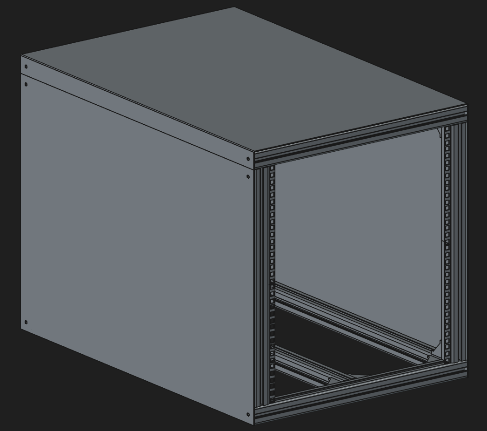
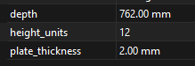

# LibreRack

LibreRack is a configurable server rack made entirely from off the shelf parts.

## Configuration

### BOM
| QTY | Item |
|-|-|
| 20 | 39mm sided 2 Hole Corner Brackets|
| 1 | 8820.08mm 4040 extrusion|
| 8 | 6U cage nut plates (2mm thickness)|
| 40 | Ball bearing backed T nuts |
| 40 | Matching screws for above |

> Note: Rough cost works out to ~$400 AUD

#### Extrusion Cut list
| QTY | Item |
|-|-|
| 4 | 533.4mm length 4040 extrusion, optionally drilled and tapped |
| 4 | 569.12mm length 4040 extrusion, optionally drilled and tapped |
| 5 | 762mm length 4040 extrusion, optionally drilled and tapped |
